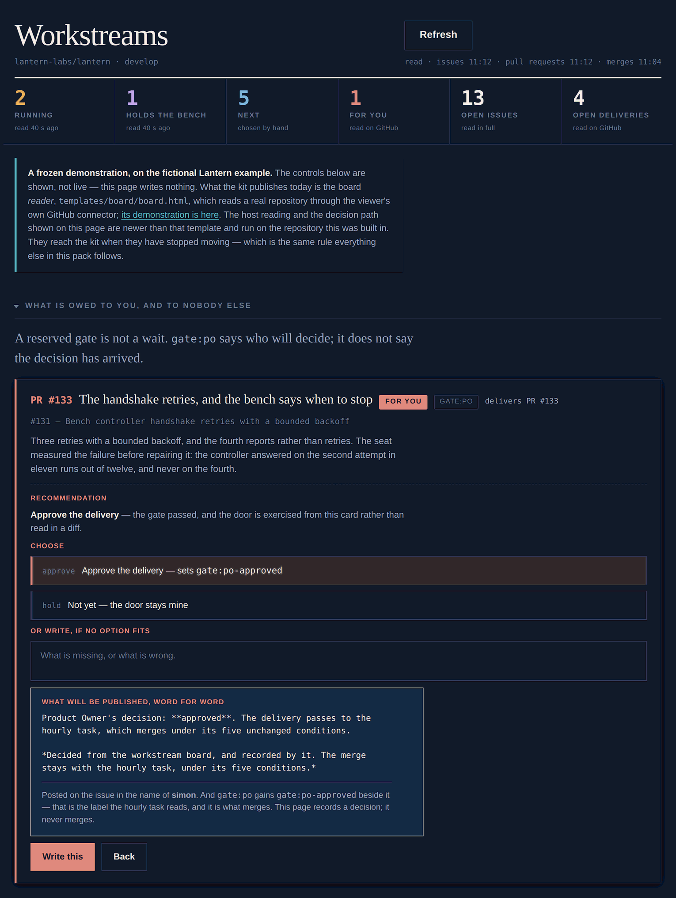
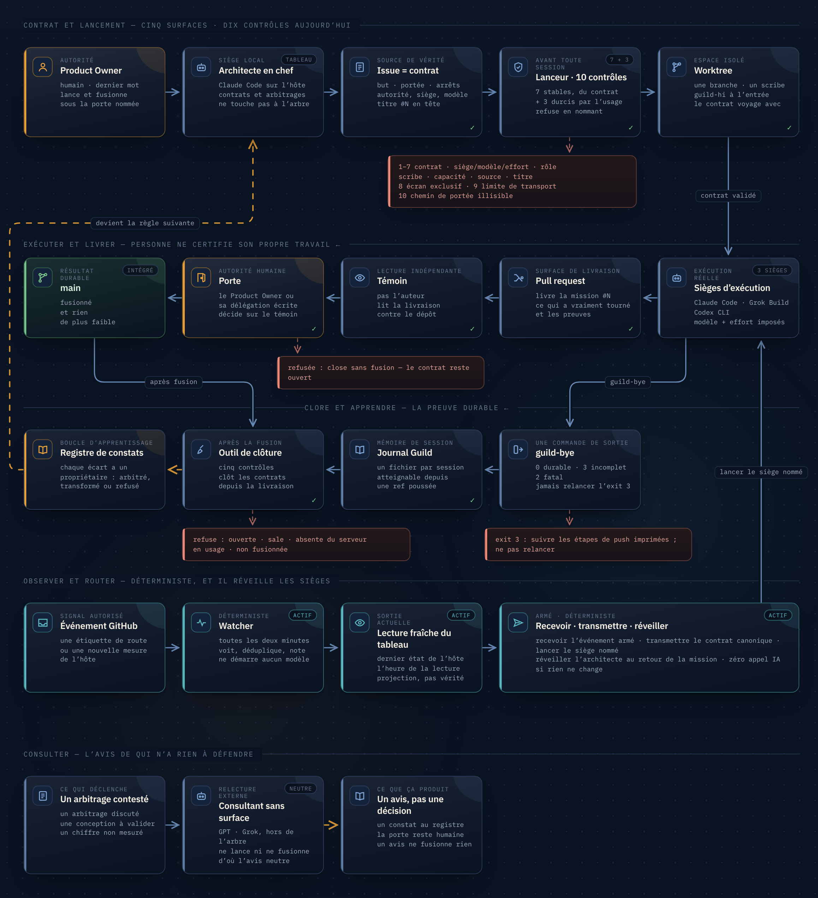

<p align="center">
  <picture>
    <source media="(prefers-color-scheme: dark)" srcset="brand/logo-lockup-dark.png">
    
  </picture>
</p>

<p align="center"><a href="README.md">English</a> · <strong>Français</strong></p>

# Guildwork

**Pack de gouvernance pour faire tourner plusieurs agents de code IA en parallèle.**

**[simon-pacifae-dupont.github.io/Guildwork/fr/](https://simon-pacifae-dupont.github.io/Guildwork/fr/)** — la même chose, sur une seule page.

**Vous ne développez pas ?** La même discipline — un contrat avant, un témoin pendant, un bilan après, et un lanceur qui refuse de démarrer ce qui n’est pas en règle — tient aussi bien un cabinet, une agence ou un service client. [Cette entrée est sur la même page.](https://simon-pacifae-dupont.github.io/Guildwork/fr/#sans-code)

Guildwork est la gouvernance qu'une seule personne a construite, incident
après incident — et qui tourne chaque jour — pour tenir une équipe
d'ingénierie IA à sept sièges sur un produit réel, à vingt-cinq merges par jour : chaque mission un
contrat, chaque merge derrière une porte nommée, chaque session laissant une
trace durable, et l'humain hors du chemin des messages. Ce dépôt est ce
système, extrait : les contrats, les formulaires, le vocabulaire, la
spécification des trois outils qui tiennent l'ensemble, et les incidents qui
ont payé chaque règle.

Il est fait pour être lu. Les trois outils sont spécifiés, pas livrés — une
page l'est : le lecteur de tableau ci-dessous, que vous pouvez ouvrir tout de
suite.

<p align="center">
  <a href="https://simon-pacifae-dupont.github.io/Guildwork/demo/board/"></a><br>
  <sub>Le tableau tel qu'il tourne, sur l'exemple fictif Lantern. Huit compteurs — un par état, vert compris — portant chacun <em>comment</em> il a été lu ; puis la seule décision qui revient au Product Owner et à personne d'autre, prise sur la page où elle se lit — le commentaire qu'elle publiera étant montré mot pour mot avant. Il ne fusionne jamais. <a href="https://simon-pacifae-dupont.github.io/Guildwork/demo/board/">Ouvrir la démonstration</a> — figée, et elle le dit sur sa face. Elle est en anglais, comme le pack ; <a href="https://simon-pacifae-dupont.github.io/Guildwork/fr/demo/board/">le lecteur livré existe en français</a>.</sub>
</p>

> **Les quinze documents du pack sont en anglais** et le restent : c'est la
> langue de travail du système, et une règle qui existe en deux versions
> finit par exister en deux versions différentes. Cette page et
> [la page de présentation](https://simon-pacifae-dupont.github.io/Guildwork/fr/)
> sont là pour décider, en français, si le reste vaut la lecture.

## Le problème

Plusieurs agents de code IA — éditeurs différents, harnais différents — qui
travaillent en même temps sur un seul dépôt produisent quatre dégâts
qu'aucun prompt ne corrige : deux agents qui écrivent le même fichier, avec
l'humain en guise d'outil de merge ; un agent qui tourne sous un modèle, un
niveau d'effort ou un prompt que personne n'a déclarés, sans que rien
n'enregistre la substitution ; ce qu'un agent a appris qui meurt avec sa
fenêtre de contexte, si bien que la session suivante le redécouvre ou
travaille sur un résumé périmé, avec assurance ; et l'humain qui finit par
porter les instructions d'un agent à l'autre à la main, ce qui est
précisément le poste que les agents devaient supprimer.

## La forme de la réponse

GitHub est la source de vérité, avec cinq surfaces qui ont chacune
exactement un rôle : l'**issue** est le contrat, le **tableau** est la file,
le **worktree** est l'espace de travail, la **pull request** est la
livraison, le **journal** est la mémoire de session. Une mission énoncée
ailleurs n'existe pas.

Un **lanceur** lit le contrat par son numéro, le valide contre la
gouvernance *au commit sur lequel la mission va tourner*, vérifie sept
conditions, et refuse — en nommant la condition qui a sauté — ou bien crée
l'espace de travail, effectue l'entrée de session, et démarre le harnais
déclaré sous le modèle et l'effort déclarés, avec une première instruction
générée depuis l'issue. Un **cycle de session** ouvre chaque session en
lisant ce que la précédente a laissé, et la referme avec une seule commande
de sortie dont le code est décidé par la seule durabilité. Un **outil de
clôture** refuse de supprimer tout worktree dont la matière n'est pas
préservée de façon démontrable, et clôt les contrats depuis leurs livraisons
fusionnées, avec quatre refus qui lui sont propres.

Sous les outils, quatre principes : *mesuré, pas supposé* ; *échouer fermé,
et dire quelle condition* ; *un refus n'empêche pas la mission, il la
déplace hors de la porte* ; *durable veut dire atteignable depuis une
référence poussée*.

<p align="center">
  <a href="brand/lifecycle-canvas.fr.png"></a><br>
  <sub>À lire pour ses points d'arrêt : sept conditions avant qu'une session démarre, un témoin et une porte avant que quoi que ce soit n'atterrisse, trois codes de sortie décidés par la seule durabilité, et un registre qui renvoie chaque incident dans le contrat suivant. <a href="https://simon-pacifae-dupont.github.io/Guildwork/brand/lifecycle-canvas.fr.html">Version interactive</a> — survolez un bloc pour isoler son chemin.</sub>
</p>

**Le tableau, lu pour ce qu'il doit à chaque siège.** Six compteurs, puis
trois questions dans cet ordre : ce qui attend la décision du Product Owner
et celle de personne d'autre, ce que l'architecte fusionne sous délégation
sans lui, et ce qui n'entre dans aucune règle — une pull request sans ligne
`Mission:`, une livraison qui nomme une mission close, un lot sans chantier.
Ces derniers sont comptés sur la face du tableau plutôt que rangés au jugé,
et ces compteurs sont faits pour afficher zéro. Chaque chiffre porte la
façon dont il a été obtenu : un compte lu en entier et un compte qui s'est
arrêté en route ne sont pas la même affirmation.

Il ne détient aucun jeton et ne recopie rien : il lit le dépôt par le
connecteur GitHub du lecteur. Il ne fusionne jamais — la page est à un
partage de n'importe qui, et un bouton de fusion sur une page partageable
est une porte que tout le monde franchit. Et il publie ce qu'il ne voit
pas : une session sur une autre machine, un processus qui n'expose pas sa
ligne de commande, un agent lancé à la main.

Ce que le pack livre aujourd'hui, c'est le *lecteur*, sous
`templates/board/`. La lecture de l'hôte et le chemin de décision montrés
dans la démonstration sont plus récents, et rejoindront le pack quand ils
auront cessé de bouger — c'est la règle que tout le reste ici applique.
[Démonstration](https://simon-pacifae-dupont.github.io/Guildwork/demo/board/) ·
[le lecteur livré, en français](https://simon-pacifae-dupont.github.io/Guildwork/fr/demo/board/).

## Ce que contient ce dépôt

```
docs/        quinze documents, numérotés dans l'ordre de lecture
templates/   les fichiers à poser dans un dépôt : formulaire d'issue, gabarit de
             pull request, recette d'étiquettes, profils de rôle, format de journal,
             manifeste des chemins régénérables, registre de constats, convention de changelog
examples/    une mission fictive suivie de bout en bout — issue, transcription du
             lanceur, instruction générée, rapport de transmission, pull request,
             entrée de journal, transcription de clôture, registre
```

| Document | Ce qu'il tranche |
|---|---|
| [00 — Le modèle de fonctionnement](docs/00-operating-model.md) | les cinq surfaces, les sièges, le cycle de vie, les principes |
| [01 — Le contrat de mission](docs/01-mission-contract.md) | le formulaire d'issue champ par champ, l'ordre conservateur des options, ce qu'un commentaire peut amender |
| [02 — Le contrat de livraison](docs/02-delivery-contract.md) | le gabarit de pull request, la ligne `Mission:` et ses trois états, qui dispose de ce qu'une exécution a créé |
| [03 — La taxonomie d'étiquettes](docs/03-label-taxonomy.md) | dix-sept étiquettes et pas une de plus ; les étiquettes de routage sont des événements, celles de chantier sont descriptives |
| [04 — Capacités et routage](docs/04-capabilities-and-routing.md) | trois atomes, une énumération qui n'est pas une échelle, `unknown` route comme *ne peut pas* |
| [05 — Le lanceur](docs/05-launcher.md) | les sept conditions — et pourquoi l'implémentation de référence en refuse dix — l'épinglage de la gouvernance, `--resume`, `--list`, l'instruction générée |
| [06 — Entrée et sortie de session](docs/06-session-cycle.md) | `guild-hi`, `guild-bye`, les codes de sortie 0/2/3, la déclaration à trois états |
| [07 — L'outil de clôture](docs/07-closeout.md) | cinq conditions, le manifeste des chemins régénérables, ce qui clôt une mission |
| [08 — La continuité](docs/08-continuity.md) | la préséance des sources, les sept modes de défaillance, ce qu'une passation doit à celui qui suit |
| [09 — Le registre de constats](docs/09-findings-register.md) | une issue, deux sorties, revue à chaque passage |
| [10 — Effort et paramètres d'exécution](docs/10-effort-and-execution-parameters.md) | la correspondance exacte, les niveaux par siège, *dire ce qui a tourné* |
| [11 — Les fragments de changelog](docs/11-changelog-fragments.md) | un fichier par mission, assemblés à la release |
| [12 — Les incidents](docs/12-incidents.md) | quarante-sept défaillances, et la règle que chacune a payée |
| [13 — Les chiffres](docs/13-by-the-numbers.md) | les chiffres réels du projet, domaine retiré |
| [14 — Le chemin d'adoption](docs/14-adoption-path.md) | quoi faire dans quel ordre, et ce que ce pack ne contient pas |

## Quinze minutes

Lisez `00` pour la forme, `12` pour la raison de cette forme, et la
transcription du lanceur dans `examples/lantern/launcher-dry-run.md` pour ce
que ça fait à l'usage. Si ces trois-là en méritent un quatrième, lisez `05`.

## Dix minutes pour installer

```
git clone https://github.com/Simon-Pacifae-Dupont/Guildwork
mkdir -p votre-depot/.github && cp -r Guildwork/templates/github/. votre-depot/.github/
cd votre-depot && sh ../Guildwork/templates/labels.sh
```

Trois commandes : le formulaire d'issue et le gabarit de pull request
atterrissent dans `.github/` sur votre branche par défaut, et les dix-sept
étiquettes, les routes `watcher:*` et les chantiers `chantier:*` sont créés
une fois, par un humain (sous Windows, lancez les lignes `gh label` de
`labels.sh` depuis PowerShell). Ouvrez ensuite une issue avec le formulaire
*AI mission* — le premier contrat existe. Le lanceur qui le lira est à vous
d'écrire, depuis `05` ; `templates/README.md` dit quelle valeur est celle de
Lantern et ce qui vous reste à écrire.

## D'où ça vient

Une application de bureau Windows en Python avec une suite de 12 100 tests,
un seul humain Product Owner, une session Claude Cowork comme architecte en
chef, des sièges d'exécution sur Claude Code et Grok, et Codex en relecteur
externe. Dans les douze jours
jusqu'au 6 septembre 2026, 323 contrats ont été ouverts et 300 pull requests
fusionnées ; 531 sessions se sont closes avec une entrée de journal, sur les
35 jours d'existence du journal. `docs/13-by-the-numbers.md` contient la table
complète, et ses deux lectures.

Tous les exemples sont réécrits sur un projet fictif, **Lantern** — un
tableau de bord de capteurs d'atelier relié à un contrôleur de banc — pour
que les mécaniques puissent être montrées sans décrire le produit réel. Rien
de ce qui concerne Lantern n'est porteur.

## Où ça va

Le kit est la partie qui a cessé de bouger. Trois choses bougent encore sur
le projet dont il vient, et chacune rejoindra le kit comme tout ce qui est
ici : une fois qu'un incident réel l'aura payée. Le tableau devient le
contrôle : pas un rapport sur les agents, mais la page où la seule décision
qui revient au Product Owner se prend et s'enregistre du même clic. Un
veilleur voit ce qu'un tableau ne peut pas voir : un siège arrêté sur une
demande de permission ressemble trait pour trait à un siège qui travaille,
et la règle est en train d'être payée cette semaine. Et les mêmes sept
états — en cours, tient l'écran, à venir, pour vous, atterri, cassé,
périmé — sont sur chaque tableau, quoi qu'il suive ; les noms s'adaptent au
projet, les positions et les teintes non (`brand/design-system.md`).

## Ce que ce n'est pas

Ni un framework, ni un runtime, ni une extension. Les trois outils sont
spécifiés dans `05`, `06` et `07` assez précisément pour être audités ou
réimplémentés, et ils ne sont pas livrés : installer tout ceci sur un dépôt,
adapter le vocabulaire aux sièges et aux chantiers d'une équipe, mesurer la
table des capacités sur ses machines, écrire les outils contre ses harnais,
et mener les deux premières semaines de missions à ses côtés — c'est ça, le
travail. Et c'est le travail que fait l'auteur.

## Contact

Simon Dupont — [GitHub](https://github.com/simon-pacifae-dupont) ·
[LinkedIn](https://www.linkedin.com/in/simon-pacifae-dupont/) ·
simon.pacifae.dupont@gmail.com. Si vous faites tourner, ou comptez faire
tourner, plus d'un agent de code IA sur un code qui compte, écrivez.

## Licence

MIT — voir `LICENSE`. Le projet Lantern, son dépôt, ses personnes et ses
chiffres sont fictifs ; les chiffres de `docs/13-by-the-numbers.md` sont
réels ; ils ont été mesurés le 6 septembre 2026, sur des jours complets uniquement.
