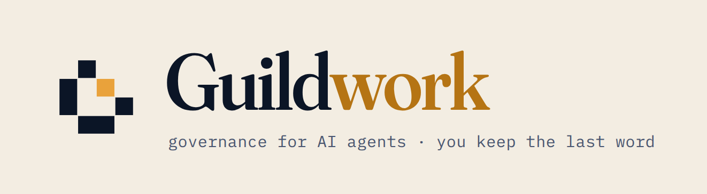
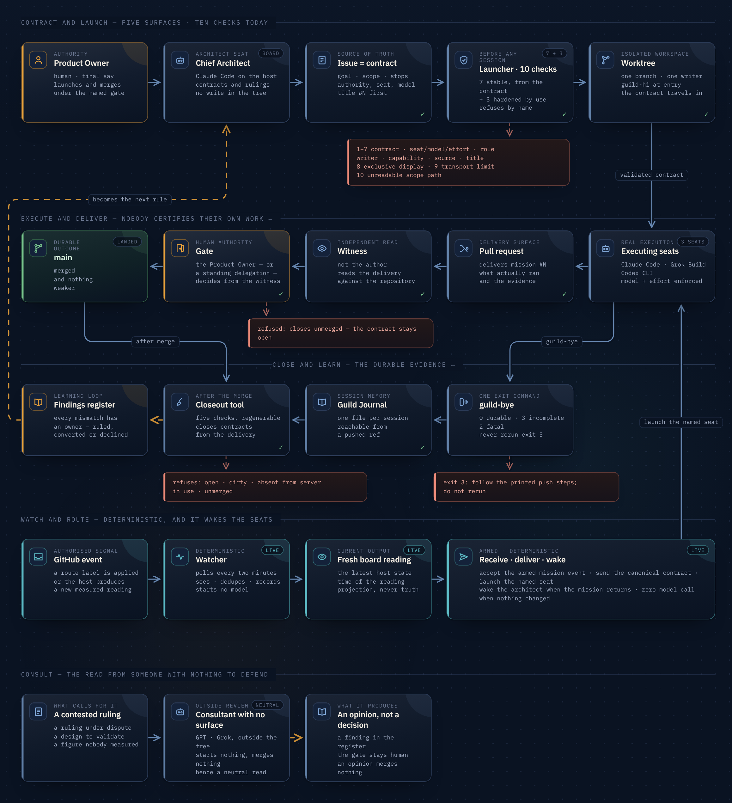

<p align="center">
  <picture>
    <source media="(prefers-color-scheme: dark)" srcset="brand/logo-lockup-dark.png">
    
  </picture>
</p>

# Guildwork

**Governance kit for running parallel AI coding agents.**

**[simon-pacifae-dupont.github.io/Guildwork](https://simon-pacifae-dupont.github.io/Guildwork/)** — the same thing, on one page.

Guildwork is the governance one person built, incident by incident, to run
a seven-seat AI engineering team on a real product at twenty-one merges a
day — with every mission a contract, every merge behind a named gate, every
session leaving a durable record, and the human out of the message path.
This repository is that system, extracted: the contracts, the forms, the
vocabulary, the specification of the three tools that hold it together, and
the incidents that paid for every rule.

It ships no code. It is meant to be read.

## The problem

Several AI coding agents — different vendors, different harnesses — working
on one repository at once produce four kinds of damage that no prompt
cures: two agents writing the same file, with the human as the merge tool;
an agent running under a model, an effort or a prompt nobody declared, with
nothing recording the substitution; what an agent learned dying with its
context window, so the next session re-derives it or works from a stale
summary with confidence; and the human ending up carrying instructions
between agents by hand, which is the one job the agents were supposed to
remove.

## The shape of the answer

GitHub is the source of truth, with five surfaces that each have exactly
one job: the **issue** is the contract, the **board** is the queue, the
**worktree** is the workspace, the **pull request** is the delivery, the
**journal** is the session memory. A mission stated anywhere else does not
exist.

A **launcher** reads the contract by number, validates it against the
governance *at the commit the mission will run on*, checks seven
conditions, and refuses — naming which condition fired — or creates the
workspace, performs the session entry, and starts the declared harness
under the declared model and effort with a first instruction generated
from the issue. A **session cycle** opens every session by reading what
the last one left and closes it with exactly one exit command whose exit
code is decided by durability alone. A **closeout tool** refuses to remove
any worktree whose material is not provably preserved, and closes contracts
from their merged deliveries with four refusals of its own.

Under the tools, four principles: *measured, not assumed*; *fail closed,
and say which condition*; *a refusal does not prevent the mission, it moves
it outside the gate*; *durable means reachable from a pushed ref*.

<p align="center">
  <a href="brand/lifecycle-canvas.png"></a><br>
  <sub>Read for where it can stop: seven conditions before a session starts, a witness and a gate before anything lands, three exit codes decided by durability alone, and a register that sends every incident back into the next contract. <a href="https://simon-pacifae-dupont.github.io/Guildwork/brand/lifecycle-canvas.html">Interactive version</a> — hover a block to isolate its path.</sub>
</p>

## What is in this repository

```
docs/        fifteen documents, numbered in reading order
templates/   the files to drop into a repository: issue form, pull request template,
             label recipe, role profiles, journal format, regenerable-paths manifest,
             findings register, changelog convention
examples/    one fictional mission followed end to end — issue, launcher transcript,
             generated instruction, transmission report, pull request, journal entry,
             closeout transcript, register
```

| Document | What it settles |
|---|---|
| [00 — The operating model](docs/00-operating-model.md) | the five surfaces, the seats, the lifecycle, the principles |
| [01 — The mission contract](docs/01-mission-contract.md) | the issue form field by field, conservative ordering, what a comment may amend |
| [02 — The delivery contract](docs/02-delivery-contract.md) | the pull request template, the `Mission:` line and its three states, who disposes of what a run created |
| [03 — The label taxonomy](docs/03-label-taxonomy.md) | seventeen labels and no more; routing labels are events; workstream labels are descriptive |
| [04 — Capabilities and routing](docs/04-capabilities-and-routing.md) | three atoms, an enumeration that is not a ladder, `unknown` routes as cannot |
| [05 — The launcher](docs/05-launcher.md) | the seven conditions, the governance pin, `--resume`, `--list`, the generated instruction |
| [06 — Session entry and exit](docs/06-session-cycle.md) | `guild-hi`, `guild-bye`, exit codes 0/2/3, the three-state declaration |
| [07 — The closeout tool](docs/07-closeout.md) | five conditions, the regenerable-paths manifest, what closes a mission |
| [08 — Continuity](docs/08-continuity.md) | source precedence, the seven failure modes, what a handover owes its successor |
| [09 — The findings register](docs/09-findings-register.md) | one issue, two exits, reviewed at every sweep |
| [10 — Effort and execution parameters](docs/10-effort-and-execution-parameters.md) | the exact mapping, per-seat levels, *state what ran* |
| [11 — Changelog fragments](docs/11-changelog-fragments.md) | one file per mission, assembled at release |
| [12 — Incidents](docs/12-incidents.md) | about forty-five failures, and the rule each one paid for |
| [13 — By the numbers](docs/13-by-the-numbers.md) | the real project's figures, domain removed |
| [14 — The adoption path](docs/14-adoption-path.md) | what to do in what order, and what this pack does not contain |

## Fifteen minutes

Read `00` for the shape, `12` for why it is shaped that way, and the
launcher transcript in `examples/lantern/launcher-dry-run.md` for what it
feels like to run. If those three earn a fourth, read `05`.

## Where it comes from

A Windows desktop application in Python with a 12 000-test suite, one human
Product Owner, a Claude Cowork session as Chief Architect, executing seats
on Claude Code and Grok, and Codex as an external reviewer. In the eleven days
after the mission form went live, 229 contracts were opened and 231 pull
requests merged; 441 sessions closed with a journal entry in the 33 days
since the journal existed. `docs/13-by-the-numbers.md` has the full table,
and both readings of it.

Every example here is rewritten on a fictional project, **Lantern** — a
workshop sensor dashboard with a bridge to a bench controller — so that the
mechanics can be shown without describing the real product. Nothing about
Lantern is load-bearing.

## What it is not

Not a framework, not a runtime, not an extension. The three tools are specified
in `05`, `06` and `07` precisely enough to audit or re-implement, and they
are not shipped: installing this on a repository, adapting the vocabulary to
a team's own seats and workstreams, measuring the capability table on the
team's machines, writing the tools against the team's harnesses, and
running the first two weeks of missions alongside the team is the work —
and it is the work the author does.

## Contact

Simon Dupont — [GitHub](https://github.com/simon-pacifae-dupont) ·
[LinkedIn](https://www.linkedin.com/in/simon-pacifae-dupont/) ·
simon.pacifae.dupont@gmail.com. If you run, or intend to run, more than one
AI coding agent on a codebase that matters, write.

## License

MIT — see `LICENSE`. The Lantern project, its repository, its people and
its numbers are fictional; the figures in `docs/13-by-the-numbers.md` are
real and were measured on 4 September 2026.
